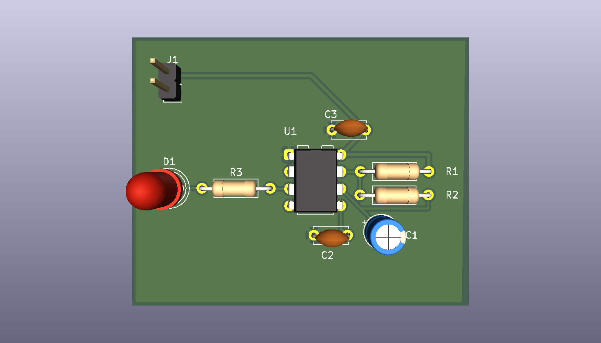

# 555-timer-pcb
A 555 timer PCB designed in KiCad.

## Project Overview

This is my first PCB design project, created to learn the complete PCB design workflow using KiCad. The circuit uses an NE555 timer in astable mode to generate a repeating output signal that drives an LED.

The project covers schematic design, footprint assignment, PCB layout, component placement, routing, ground planes, ERC/DRC verification, and manufacturing file generation.

## Features

- NE555 timer configured in astable mode
- LED output indicator
- Through-hole components for easy assembly
- 5 V power input
- Ground plane for GND connections
- PCB designed and routed in KiCad
- ERC and DRC verified

## Components

- NE555 timer IC
- 10 kΩ resistor
- 100 kΩ resistor
- 1 kΩ LED current-limiting resistor
- 10 µF electrolytic capacitor
- 10 nF capacitor
- 100 nF decoupling capacitor
- LED
- 2-pin power connector

## How It Works

The NE555 timer is configured in astable mode, meaning it continuously switches between HIGH and LOW without requiring an external trigger. R1, R2, and C1 control the timing of the oscillation.

As C1 repeatedly charges and discharges, the NE555 output at pin 3 switches between HIGH and LOW. The output drives the LED through R3, causing the LED to blink.

C2 and C3 are used for stability and noise filtering.

## Design Process

1. Created the NE555 astable timer schematic in KiCad.
2. Ran ERC to check the schematic for electrical errors.
3. Assigned through-hole footprints to each component.
4. Created the PCB board outline and placed the components.
5. Routed the signal and power traces.
6. Added a copper ground plane connected to GND.
7. Ran DRC and schematic parity checks to verify the final PCB layout.

## PCB 3D View

## What I Learned

Through this project, I learned how to:

- Create and verify a schematic in KiCad
- Select and assign component footprints
- Place components with routing and assembly in mind
- Route signal and power traces
- Use net classes to define different trace widths
- Create a copper ground plane
- Use ERC and DRC to identify design issues
- Inspect a completed PCB using KiCad's 3D Viewer
- Prepare a PCB design for manufacturing